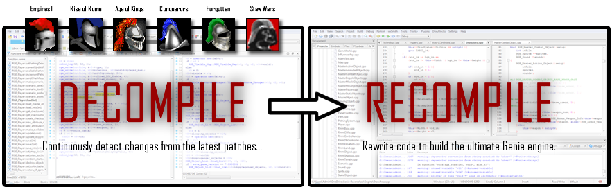

# Genie-Reverse
*The reverse engineering of the Genie-Engine.*

Please help us translate the entire Genie engine in pure C++!

## Introduction
Reversing the Genie-Engine involves:
 * Daunting research with timely analysis, by observing huge amounts of pseudocode.
 * Renaming vast amounts of procedures, identifying variables, and eliminating libraries.
 * Mapping memory allocated structures, and backtracing entire programming interfaces.
 * Performing trial-error testing, and verifying whether properties match playability.

## Acknowledgements
Many individuals across communities over the past years have been involved in reversing the Genie-Engine.
This particular repository contains the involvements of the following individuals:
 * **Yvan Burrie** *Author of Genie-Studio, researched the scenario format and other structures.*
 * **JustTesting1234** *Special thanks to him for researching; the database, scenario triggers, and many other structures.*
 * **[Piruzzolo](https://github.com/Piruzzolo)**.

## Glance
The Genie-Engine is reasonably well architectured:
 * It holds various database files (DAT) to load all data corresponding to the scheme of the game.
 * It uses external files, mostly organized in file-mapping (DRS) storage, allowing customized modifications.
However, the Genie-Engine obtained certain issues:
 * The engine contains certain bugs left out.
 * The engine contains hard-coded data converged to the database, for example:
    * Fixed number of terrains and borders.
    * Many IDs of structures related to the database are left embeded.

## History
 * The *Genie Engine* began in early 1995 by *Ensemble Studios* using their prototype *Dawn of Man*.
 * By early 1996, the engine was fully working with 10,000 lines of ASM coding, using the *Tribe* protoype.
 * By early 1997, the engine was nicely refined, and the *Age of Empires* prototype was finally used.
 * In 2001, *Lucas Art* licensed the engine for *Star Wars Gallactic Battlegrounds*.

## Executables
Below is a list of variants, some are EXE files we analyzed, others are only known to exist. 

| File-Name        | Build Version       | Build Date    | Prototype              | Description
|------------------|---------------------|---------------|------------------------|---------------
| etribemp._xe     | 00.04.03.0113       | 1997/01/13    | `AOE0004030113`        | *Age of Empires I: (Alpha)*
| ptribe.exe       | 00.04.04.0125       | 1997/01/25    | `AOE0004040113`        | *Age of Empires I: (Alpha)*
| dcptribe.exe     | 00.04.05.0130       | 1997/01/30    | `AOE0004050130`        | *Age of Empires I: (Alpha)*
| tribe2.exe       | 00.04.05.0202       | 1997/02/02    | `AOE0004050202`        | *Age of Empires I: (Alpha)*
| etribemp.exe     | 00.05.01.0203       | 1997/02/03    | `AOE0005010203`        | *Age of Empires I: (Alpha)*
| tribed.exe       | 00.05.01.0204       | 1997/02/04    | `AOE0005010204`        | *Age of Empires I: (Alpha)*
| empires.exe      | 00.07.14.0604       | 1997/06/04    | `AOE0007140604`        | *Age of Empires I: (Alpha)*
| empires.exe      | 00.08.04.0703       | 1997/07/03    | `AOE0008040703`        | *Age of Empires I: (Alpha)*
| empires.exe      | 00.08.09.0716       | 1997/07/16    | `AOE0008090716`        | *Age of Empires I: (Patch 1.0 Beta)*
| empires.exe      | 00.08.29.0811       | 1997/08/11    | `AOE0008290811`        | *Age of Empires I: (Patch 1.0 CGWM)*
| empires.exe      | 00.08.68.0917       | 1997/09/17    | `AOE0008680917`        | *Age of Empires I: (Patch 1.0 Retail)*
| empires.exe      | 00.08.69.0922       | 1997/09/02    | `AOE0008690922`        | *Age of Empires I: (Patch 1.0 Trial)*
| empires.exe      | 00.08.69.1002       | 1997/10/02    | `AOE0008691022`        | *Age of Empires I: (Patch 1.0 Trial)*
| empires.exe      | 00.09.12.1215       | 1997/12/15    | `AOE0009121215`        | *Age of Empires I: (Patch 1.0a Retail)*
| empires.exe      | 00.09.13.0409       | 1998/04/23    | `AOE0009130409`        | *Age of Empires I: (Patch 1.0b Retail)*
| empires.exe      | 00.09.13.1115       | 1999/12/01    | `AOE0009131115`        | *Age of Empires I: (Patch 1.0c Retail Gold)*
| ???              | 00.02.02.0703       | 1998/07/??    | `ROR0002020703`        | *Age of Empires I: ???*
| empiresx.exe     | 00.03.01.0717       | 1998/07/17    | `ROR0003010717`        | *Age of Empires I: Roman Expansion (Alpha)*
| ???              | 00.03.05.0803       | 1998/08/??    | `ROR0003050803`        | *Age of Empires I: The Rise of Rome ???*
| ???              | 00.04.01.0828       | 1998/08/??    | `ROR0004010828`        | *Age of Empires I: The Rise of Rome ???*
| empiresx.exe     | 00.04.02.0901       | 1998/09/01    | `ROR0004020901`        | *Age of Empires I: The Rise of Rome (Patch 1.0 Retail)*
| empiresx.exe     | 00.01.06.1006       | 1998/10/06    | `ROR0001061006DEMO`    | *Age of Empires I: The Rise of Rome (Patch 1.0 Trial)*
| empiresx.exe     | 00.01.06.1115       | 1999/12/01    | `ROR0001061006`        | *Age of Empires I: The Rise of Rome (Patch 1.0a Retail)*
| empiresx.exe     | 00.01.06.1116       | ???           | `ROR0001061115`        | *Age of Empires I: The Rise of Rome (Patch 1.0a Retail Gold)*
| empiresx.exe     | 00.01.06.1116       | ???           | `ROR0001061116`        | *Age of Empires I: The Rise of Rome (User-Patch 1.1 Beta 1)*
| empiresx.exe     | 00.01.06.1117       | ???           | `ROR0001061117`        | *Age of Empires I: The Rise of Rome (User-Patch 1.1 Beta 2)*
| empiresx.exe     | 00.01.06.1118       | ???           | `ROR0001061118`        | *Age of Empires I: The Rise of Rome (User-Patch 1.1 Release 1)*
| empiresx.exe     | 00.01.06.1119       | ???           | `ROR0001061119`        | *Age of Empires I: The Rise of Rome (User-Patch 1.1 Release 1a)*
| empiresx.exe     | 00.01.06.1120       | ???           | `ROR0001061120`        | *Age of Empires I: The Rise of Rome (User-Patch 1.1 Release 2)*
| empiresx.exe     | 00.01.06.1121       | ???           | `ROR0001061121`        | *Age of Empires I: The Rise of Rome (User-Patch 1.1 Release 3)*
| ???              | 00.04.03.0521       | 1999/05/21    | `AOK0004030521`        | *Age of Empires II:*
| ???              | 00.05.03.0706       | 2001/08/09    | `AOK0005030706`        | *Age of Empires II: The Age of Kings*
| empires2.exe     | 00.06.01.0717       | 1998/07/17    | `AOK0006010717`        | *Age of Empires II, The Age of Kings (E3 1998)*
| empires2.exe     | 00.09.07.0215       | 1999/02/15    | `AOK0009070215`        | *Age of Empires II, The Age of Kings (known build)*
| empires2.exe     | 00.09.07.0222       | 1999/02/02    | `AOK0009070222`        | *Age of Empires II, The Age of Kings (Patch 1.0 Beta 1)*
| empires2.exe     | 00.11.20.0614       | 1999/06/14    | `AOK0011200614`        | *Age of Empires II, The Age of Kings (Patch 1.0 Beta 1)*
| empires2.exe     | 00.11.23.0622       | 1999/02/02    | `AOK0011230622`        | *Age of Empires II, The Age of Kings (Official Beta 2)*
| empires2.exe     | 00.11.26.0701       | 1999/07/01    | `AOK0011260701`        | *Age of Empires II, The Age of Kings (Official Beta 3)*
| empires2.exe     | 00.14.11.0909       | 1999/09/09    | `AOK0014110909`        | *Age of Empires II, The Age of Kings (???)*
| empires2.exe     | 00.14.14.0914       | 1999/09/14    | `AOK0014140914`        | *Age of Empires II, The Age of Kings (???)*
| empires2.exe     | 00.14.18.1014       | 1999/10/14    | `AOK0014181014`        | *Age of Empires II, The Age of Kings (???)*
| empires2.exe     | 00.14.19.1018       | 1999/10/18    | `AOK0014191018`        | *Age of Empires II, The Age of Kings (Patch 2.0 Trial)*
| empires2.exe     | 00.14.22.0712       | 2000/07/12    | `AOK0014220712`        | *Age of Empires II, The Age of Kings (Patch 2.0a)*
| ???              | 00.07.10.0612       | 2000/06/12    | `AOC0007100612`        | *Age of Empires II: The Conquerors ???*
| age2_x1.exe      | 00.07.22.0627       | 2000/06/27    | `AOC0007220627`        | *Age of Empires II: The Conquerors (Patch 1.0a)*
| age2_x1.exe      | 00.07.25.0614       | 2001/06/14    | `AOC0007250614`        | *Age of Empires II: The Conquerors (Patch 1.0b)*
| age2_x1.exe      | 00.07.26.0809       | 2001/08/09    | `AOC0007260809`        | *Age of Empires II: The Conquerors (Patch 1.0c)*
| AoK HD.exe       | 02.06.0000.00       | 2013/07/27    | `HDE0206`              | *Age of Empires II: HD Edition (Patch 2.6)*
| AoK HD.exe       | 02.07.0000.00       | 2013/??/??    | `HDE0207`              | *Age of Empires II: HD Edition (Patch 2.7)*
| AoK HD.exe       | 02.08.0000.00       | 2013/09/22    | `HDE0208`              | *Age of Empires II: HD Edition (Patch 2.8)*
| AoK HD.exe       | 03.00.1521.00       | 2013/??/??    | `HDE0300152100`        | *Age of Empires II: HD Edition (Patch 3.0)*
| AoK HD.exe       | 03.00.1536.00       | 2013/11/08    | `HDE0300153600`        | *Age of Empires II: HD Edition (Patch 3.0)*
| AoK HD.exe       | 03.00.1570.00       | 2013/??/??    | `HDE0300157000`        | *Age of Empires II: HD Edition (Patch 3.0)*
| AoK HD.exe       | 03.01.1630.00       | 2013/12/06    | `HDE0301163000`        | *Age of Empires II: HD Edition (Patch 3.1)*
| AoK HD.exe       | 03.01.1645.00       | 2013/??/??    | `HDE0301164500`        | *Age of Empires II: HD Edition (Patch 3.1)*
| AoK HD.exe       | 03.02.1686.00       | 2014/??/??    | `HDE0302168600`        | *Age of Empires II: HD Edition (Patch 3.2)*
| AoK HD.exe       | 03.02.1692.00       | 2014/??/??    | `HDE0302169200`        | *Age of Empires II: HD Edition (Patch 3.2)*
| AoK HD.exe       | 03.03.1769.00       | 2014/??/??    | `HDE0303176900`        | *Age of Empires II: HD Edition (Patch 3.3)*
| AoK HD.exe       | 03.04.2058.00       | 2014/??/??    | `HDE0304205800`        | *Age of Empires II: HD Edition (Patch 3.4)*
| AoK HD.exe       | 03.04.2069.00       | 2014/??/??    | `HDE0304206900`        | *Age of Empires II: HD Edition (Patch 3.4)*
| AoK HD.exe       | 03.05.2209.00       | 2014/??/??    | `HDE0305220900`        | *Age of Empires II: HD Edition (Patch 3.5)*
| AoK HD.exe       | 03.06.2435.00       | 2014/??/??    | `HDE0306243500`        | *Age of Empires II: HD Edition (Patch 3.6)*
| AoK HD.exe       | 03.07.2608.00       | 2014/??/??    | `HDE0307260800`        | *Age of Empires II: HD Edition (Patch 3.7)*
| AoK HD.exe       | 03.08.2662.00       | 2014/??/??    | `HDE0308266200`        | *Age of Empires II: HD Edition (Patch 3.8)*
